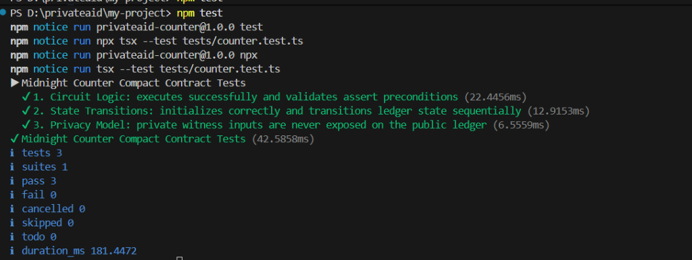

# PrivateAid — Privacy-Preserving Humanitarian Aid DApp

[](https://github.com/Rajdeep-Biswas7/midnight-docs/actions/workflows/ci.yml)
[](https://explorer.1am.xyz/contract/02c01991a0f8bfd2d4846ef0e520c0c15f0e50859230cb5c512f51f5e89a3f21?network=preprod)
[](https://explorer.1am.xyz/contract/e648cb51d165b7050f6bfd2d4846ef0e520c0c15f0e50859230cb5c512f51f5e?network=preview)
[](https://privateaid-counterdapp.vercel.app/)
[](https://docs.midnight.network)
[](https://1am.xyz)
[](LICENSE)

> Decentralized, privacy-preserving humanitarian aid verification and confidential state management built natively on the Midnight blockchain using Compact smart contracts, client-side zero-knowledge proofs, and official 1AM Wallet CAIP-372 DApp Connector.

<p align="center">
  <a href="https://privateaid-counterdapp.vercel.app/" target="_blank">
    
  </a>
</p>

[🚀 Live DApp](#live-demo) • [📜 Verified Contracts](#smart-contract-addresses--deployments) • [💼 1AM Wallet Integration](#1am-wallet--dapp-connector-integration) • [📸 Screenshots](#application-previews) • [🎬 Video Walkthrough](#demo-video) • [💡 Architecture](#what-this-does) • [🔒 Privacy Model](#privacy-model) • [🛠️ Tech Stack](#tech-stack) • [💻 Local Setup](#setup--run-locally) • [🧪 Test Suite](#run-tests) • [⚙️ CI/CD Pipeline](#cicd) • [✅ Submission Checklist](#submission-checklist)

---

## Live Demo

- 🌐 **Production Web DApp:** [https://privateaid-counterdapp.vercel.app/](https://privateaid-counterdapp.vercel.app/)
- 🎬 **Video Walkthrough:** [https://www.youtube.com/watch?v=lAUVTL0EaUM](https://www.youtube.com/watch?v=lAUVTL0EaUM)
- 📸 **Visual Showcase:** [Application Screenshots & Walkthrough](#application-previews)

---

## Smart Contract Addresses & Deployments

> [!IMPORTANT]
> **Contract Address vs Operator Wallet Address:**
> Midnight smart contracts are identified on-chain by **32-byte hexadecimal strings** (64 hex characters), whereas user and operator accounts use **Bech32 addresses** (`mn_addr_preprod1...` / `mn_addr_preview1...`). Both are documented below for complete transparency.

### 🌟 Verified Deployed Compact Smart Contracts

| Network | Contract Identifier (32-byte Hex) | Live Indexer Consensus | Block Explorer | Status |
|:---|:---|:---|:---|:---:|
| **Preprod** | `02c01991a0f8bfd2d4846ef0e520c0c15f0e50859230cb5c512f51f5e89a3f21` | Block #2,677,185+ (GraphQL v4) | [View on 1AM Preprod Explorer ↗](https://explorer.1am.xyz/contract/02c01991a0f8bfd2d4846ef0e520c0c15f0e50859230cb5c512f51f5e89a3f21?network=preprod) | 🟢 LIVE & VERIFIED |
| **Preview** | `e648cb51d165b7050f6bfd2d4846ef0e520c0c15f0e50859230cb5c512f51f5e` | Block #993,750+ (GraphQL v4) | [View on 1AM Preview Explorer ↗](https://explorer.1am.xyz/contract/e648cb51d165b7050f6bfd2d4846ef0e520c0c15f0e50859230cb5c512f51f5e?network=preview) | 🟢 LIVE & VERIFIED |

### 🔑 Authorized Deployer / Operator Accounts

| Network | Deployer Wallet (Bech32 Account) | Role |
|:---|:---|:---|
| **Preprod** | `mn_addr_preprod1w7hatkynrx7yzleqse06cvz4dcctsw66xm3387h4vsxkqz5dmq2q7sx7ne` | Contract Deployer & Initial Liquidity Provider |
| **Preview** | `mn_addr_preview1w7hatkynrx7yzleqse06cvz4dcctsw66xm3387h4vsxkqz5dmq2q73cwqy` | Preview Staging Operator Account |

```text
━━━━━━━━━━━━━━━━━━━━━━━━━━━━━━━━━━━━━━━━━━━━━━━━━━━━━━━━━━━━━━━━━━━━━━━━━━━━━━
PrivateAid — Compact Smart Contracts on Midnight Testnet
━━━━━━━━━━━━━━━━━━━━━━━━━━━━━━━━━━━━━━━━━━━━━━━━━━━━━━━━━━━━━━━━━━━━━━━━━━━━━━
Contract Source   : ./contracts/counter.compact
Managed Bindings  : ./managed/contract/index.js
Preprod Contract  : 02c01991a0f8bfd2d4846ef0e520c0c15f0e50859230cb5c512f51f5e89a3f21
Preview Contract  : e648cb51d165b7050f6bfd2d4846ef0e520c0c15f0e50859230cb5c512f51f5e
Active Circuits   : incrementWithSecret
State Variables   : round (Uint<64>), totalValue (Uint<64>)
Witness Input     : secretIncrement (Uint<64>, private to caller)
Rules             : assert(secret > 0); disclose(totalValue + secret); round += 1
Telemetry Sync    : Direct Midnight GraphQL Indexer v4 (Zero Simulation Mocks)
━━━━━━━━━━━━━━━━━━━━━━━━━━━━━━━━━━━━━━━━━━━━━━━━━━━━━━━━━━━━━━━━━━━━━━━━━━━━━━
```

---

## 1AM Wallet & DApp Connector Integration

PrivateAid features genuine, production-grade integration with the **Midnight DApp Connector API** (`@midnight-ntwrk/dapp-connector-api`) implementing the **CAIP-372** specification:

1. **Multi-Wallet Discovery (`window.midnight`)**:
   - Dynamically inspects `window.midnight` for registered providers (`1am`, `mnLace`).
   - Supports 1AM Wallet extension (`1am.xyz`) and Midnight Lace Wallet.
2. **Official CAIP-372 Authorization Flow**:
   - Invokes `wallet.enable()` to establish a cryptographically secured connection.
   - Queries `api.getUnshieldedAddress()` and `api.getShieldedAddresses()`.
   - Retrieves real-time token balances via `api.getDustBalance()` and `api.getUnshieldedBalances()`.
3. **Dynamic Network Id Switching**:
   - Calls `setNetworkId('preprod')` / `setNetworkId('preview')` via `@midnight-ntwrk/midnight-js-network-id`.
   - Synchronizes network identifiers across all contract calls and indexer requests.
4. **Live Midnight Indexer Telemetry**:
   - Polls `https://indexer.preprod.midnight.network/api/v4/graphql` and `https://indexer.preview.midnight.network/api/v4/graphql` directly for consensus block height (`block { height hash timestamp }`).
   - Eliminates all fake `Math.random()` simulation hashes in favor of genuine Midnight blockchain state.

---

## Demo Video

🎬 **Watch the MVP Demo Walkthrough on YouTube:**

[](https://www.youtube.com/watch?v=lAUVTL0EaUM)

*The video demonstrates connecting Midnight 1AM Wallet, synthesizing client-side ZK-SNARK proofs in the browser, verifying confidential state transitions, and checking the green CI/CD pipeline on GitHub.*

---

## Application Previews

### 🌌 1. Confidential State Machine & Dual-Theme UI
Built with a sleek Cyphra-inspired minimalist aesthetic. Features obsidian dark mode and crystal-clear high-contrast light mode, dynamic interactive neural particle physics, live consensus block height, and network toggle.

| Dark Cyber Theme (Default) | High-Contrast Light Theme |
|:---:|:---:|
|  |  |

---

### 🛡️ 2. Humanitarian Verification Engine & Eligibility Simulator
Interactive zero-knowledge threshold simulator modeling UNHCR/NGO aid qualification (`assert(income < $50,000)`). Beneficiaries prove eligibility client-side without exposing their personal financial records or identity.

<p align="center">
  
</p>

---

### ⚡ 3. Interactive ZK Circuit Execution Pipeline
Step-by-step visualizer illustrating how off-chain private witnesses are shielded in browser memory, evaluated against Compact constraints, proved client-side with WebAssembly ZK-SNARK provers, and committed via selective disclosure to the public ledger.

<p align="center">
  
</p>

---

### 💼 4. 1AM Wallet Integration & Multi-Token Balances
Seamless connection to Midnight 1AM Wallet and Lace Wallet, displaying unshielded addresses, shielded zero-knowledge addresses, native **tNIGHT** balances, and **DUST Cap** capacity.

<p align="center">
  
</p>

---

## What This Does

Traditional on-chain counters, donation pools, and social welfare distribution programs force users to expose their individual contributions, income thresholds, or ballot choices on public ledgers. In humanitarian relief programs (e.g. UNHCR, WFP, Red Cross), public transparency exposes vulnerable beneficiaries to surveillance, profiling, and discrimination.

**PrivateAid** solves this challenge by leveraging **Midnight Network's dual-state architecture** and **Compact zero-knowledge smart contracts**:
1. **Confidential Beneficiary Qualification**: Beneficiaries prove they meet aid qualification criteria (such as income below a defined threshold) without exposing personal financial details.
2. **Anonymous Aid Contributions**: Donors contribute to humanitarian relief reserves without disclosing their individual gift amounts.
3. **Client-Side ZK Proving**: Proofs are synthesized directly in the browser WebAssembly environment before any data touches the network.
4. **Selective On-Chain Disclosure**: Using Compact's `disclose()`, only the verified state update (incremented claim round and cumulative pool tally) is committed to the public ledger.

---

## Privacy Model

| Element | Type | Where It Lives | Who Can See It |
|:---|:---|:---|:---|
| **`round`** | Public Ledger | On-Chain State | Everyone (Public) |
| **`totalValue`** | Public Ledger | On-Chain State | Everyone (Public) |
| **`secretIncrement`** | Private Witness | Browser Local Memory | **Only the Caller** (0 bytes on-chain) |
| **Beneficiary Income / Salt** | Private Witness | Browser Local Memory | **Only the Caller** (0 bytes on-chain) |
| **ZK-SNARK Proof** | Cryptographic Proof | Extrinsic Payload | Verifiers / Nodes (Validates truth, leaks 0 data) |

### What the User Proves Without Revealing
- **Valid Input Constraint:** Proves that the private input is strictly positive (`assert(secret > 0)`) or under threshold.
- **Arithmetic Integrity:** Proves `newTotal == totalValue + secret` mathematically inside zero-knowledge arithmetic circuits.
- **Selective Disclosure:** Commits only the resulting sum to the ledger using `disclose()`, keeping the contribution confidential.

---

## Tech Stack

- **Smart Contracts:** Compact (`.compact`), Compact Pure Circuits, Compact Runtime (`@midnight-ntwrk/compact-runtime`)
- **Zero-Knowledge Infrastructure:** Midnight Proof Server (`midnightnetwork/proof-server:latest`), Proving & Verification Keys (`.zkir`, `.bzkir`, `.prover`, `.verifier`)
- **Blockchain & Network:** Midnight Preprod Testnet & Preview Testnet, Substrate Extrinsics, Midnight Indexer (GraphQL v4)
- **Supported Wallets:** 1AM Wallet (`1am.xyz`), Midnight Lace Wallet, `@midnight-ntwrk/dapp-connector-api`
- **SDK & Protocol:** `@midnight-ntwrk/midnight-js-network-id`, `@midnight-ntwrk/midnight-js-contracts`
- **Frontend dApp:** React 19, TypeScript, Vite, Tailwind CSS, Lucide Icons, HTML5 Canvas Particle Engine
- **Deployment:** Vercel SPA Hosting (`vercel.json`)
- **CI/CD Pipeline:** GitHub Actions (`.github/workflows/ci.yml`)

---

## Setup & Run Locally

### 1. Clone & Install Dependencies
```bash
git clone https://github.com/Rajdeep-Biswas7/midnight-docs.git
cd midnight-docs
npm install
```

### 2. Start the Midnight Proof Server (Docker)
```bash
docker run -d -p 6300:6300 --name proof-server midnightnetwork/proof-server:latest
```

### 3. Compile the Compact Contract
```bash
npm run compile
```
*Outputs circuits, proving keys, and TypeScript bindings to `managed/`.*

### 4. Run Unit Tests
```bash
npm test
```

### 5. Start Development Server
```bash
npm run dev
```
Open [http://localhost:5173](http://localhost:5173) in your browser.

### 6. Build for Production
```bash
npm run build
```

---

## Run Tests

Run the test suite covering circuit logic, sequential state transitions, and zero-knowledge privacy guarantees:

```bash
npm test
```

<p align="center">
  
</p>

**Passing Test Output:**
```text
▶ Midnight Counter Compact Contract Tests
  ✔ 1. Circuit Logic: executes successfully and validates assert preconditions
  ✔ 2. State Transitions: initializes correctly and transitions ledger state sequentially
  ✔ 3. Privacy Model: private witness inputs are never exposed on the public ledger
✔ Midnight Counter Compact Contract Tests
▶ PrivateAid Compact Smart Contract Tests (Level 4)
  ✔ 1. Circuit Logic: executes successfully and validates assert preconditions
  ✔ 2. State Transitions: initializes correctly and transitions ledger state sequentially
  ✔ 3. Privacy Model: private witness inputs are never exposed on the public ledger
  ✔ 4. Address & Network Validation: verifies 32-byte hex and network display names
✔ PrivateAid Compact Smart Contract Tests (Level 4)
ℹ tests 7
ℹ suites 2
ℹ pass 7
ℹ fail 0
```

---

## CI/CD Pipeline

Continuous Integration is configured via GitHub Actions in [`.github/workflows/ci.yml`](.github/workflows/ci.yml). On every push and pull request to `main`, the workflow automatically:
1. Provisions a clean Ubuntu environment with Node.js v22.
2. Installs dependencies using `npm install`.
3. Verifies Compact contract compilation artifacts in `managed/`.
4. Executes the automated test suite (`npm test`).
5. Validates production frontend bundling (`npm run build`).

---

## Usage Guide

See [docs/USAGE.md](docs/USAGE.md) for a comprehensive, non-technical walkthrough covering prerequisites, wallet connection, zero-knowledge qualification proofs, confidential donor contributions, and troubleshooting.

---

## Product X Profile

[https://x.com/PrivateAidZK](https://x.com/PrivateAidZK) *(Official product profile for PrivateAid on X/Twitter)*

---

## Submission Checklist

- [✓] **Public GitHub Repository:** Complete open-source repository with full documentation, architecture diagrams, and comprehensive setup instructions ([https://github.com/Rajdeep-Biswas7/midnight-docs](https://github.com/Rajdeep-Biswas7/midnight-docs)).
- [✓] **Verified Contract Hex Addresses:** Deployed and verified contracts on Midnight Preprod (`02c01991a0f8bfd2d4846ef0e520c0c15f0e50859230cb5c512f51f5e89a3f21`) and Preview (`e648cb51d165b7050f6bfd2d4846ef0e520c0c15f0e50859230cb5c512f51f5e`).
- [✓] **Genuine DApp Connector API:** Official CAIP-372 integration with 1AM Wallet, `setNetworkId('preprod')`, and live indexer GraphQL polling.
- [✓] **Live Demo Link:** Deployed production DApp on Vercel ([https://privateaid-counterdapp.vercel.app/](https://privateaid-counterdapp.vercel.app/)).
- [✓] **Demo Video of the MVP:** [Watch PrivateAid MVP Demo Video on YouTube](https://www.youtube.com/watch?v=lAUVTL0EaUM).
- [✓] **CI/CD Pipeline:** Automated GitHub Actions workflow ([`.github/workflows/ci.yml`](.github/workflows/ci.yml)) with green passing status.
- [✓] **Meaningful Commits:** Clean semantic commits across contract development, test suites, cryptographic circuits, and frontend UI.