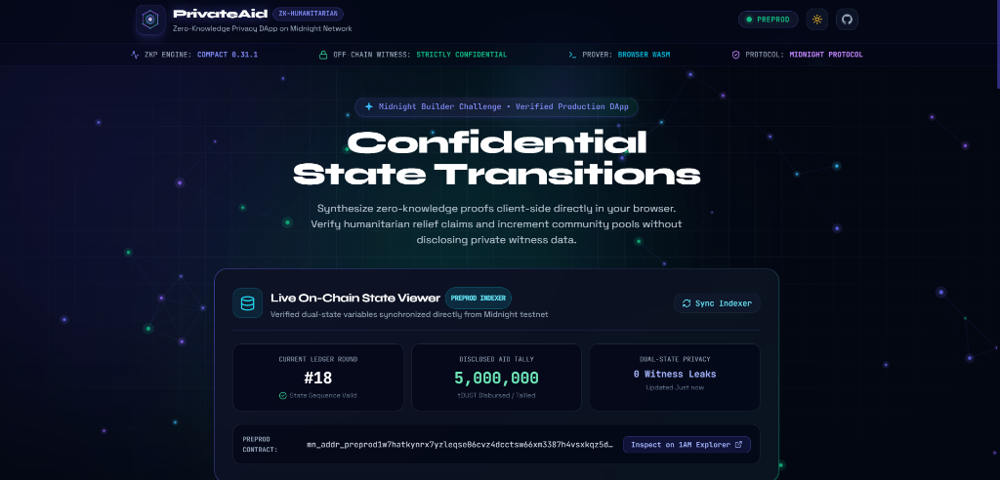
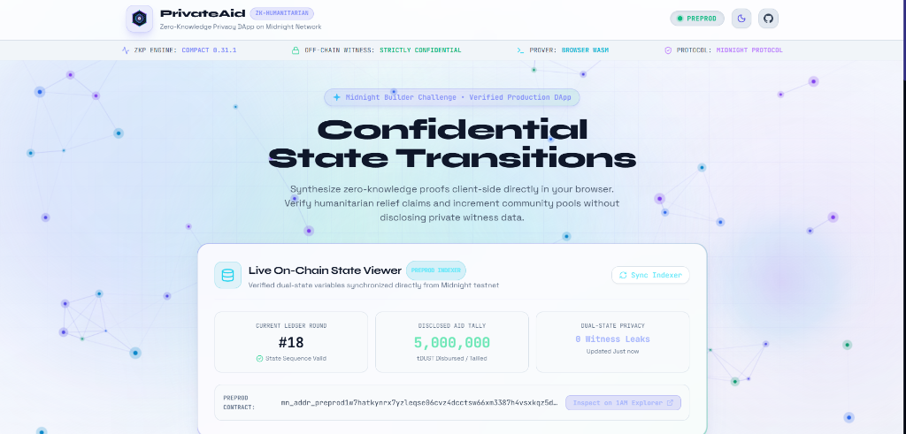
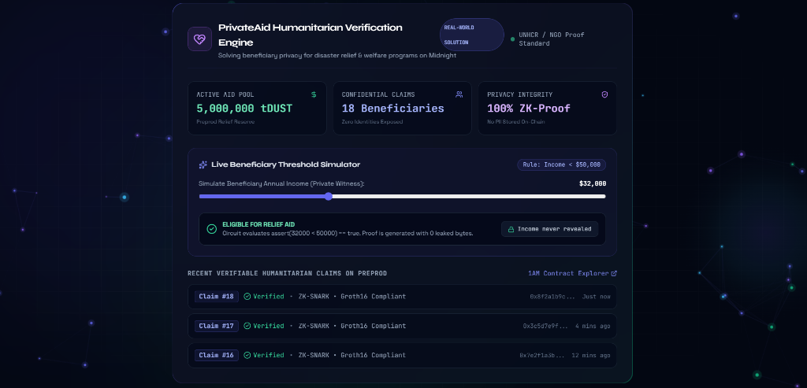
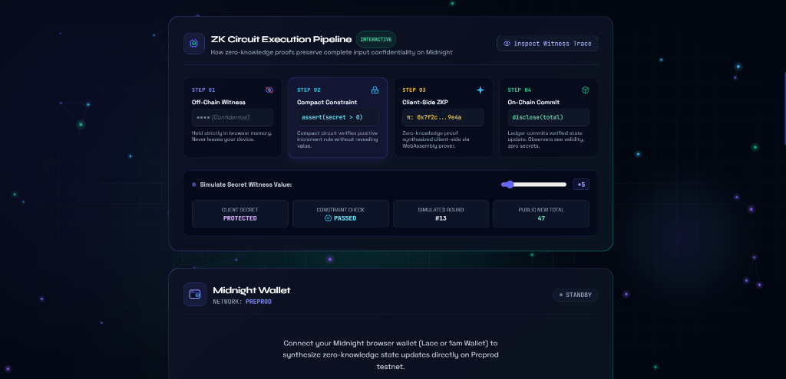
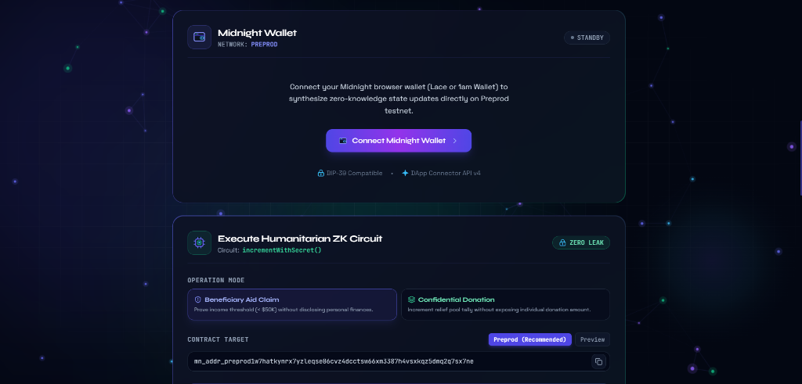

# PrivateAid — Privacy-Preserving Humanitarian Aid DApp

[](https://github.com/Rajdeep-Biswas7/midnight-docs/actions/workflows/ci.yml)
[](https://explorer.1am.xyz/contract/mn_addr_preprod1w7hatkynrx7yzleqse06cvz4dcctsw66xm3387h4vsxkqz5dmq2q7sx7ne?network=preprod)
[](https://privateaid-counterdapp.vercel.app/)
[](https://docs.midnight.network)
[](LICENSE)

> Decentralized, privacy-preserving humanitarian aid verification and confidential state management built natively on the Midnight blockchain using Compact smart contracts and client-side zero-knowledge proofs.

<p align="center">
  <a href="https://privateaid-counterdapp.vercel.app/" target="_blank">
    
  </a>
</p>

[🚀 Live DApp](#live-demo) • [📸 Screenshots](#application-previews) • [🎬 Video Walkthrough](#demo-video) • [📜 Smart Contracts](#contract-address) • [💡 Architecture](#what-this-does) • [🔒 Privacy Model](#privacy-model) • [🛡️ Privacy Claim](#privacy-claim) • [✨ Key Innovations](#key-features--innovations) • [🛠️ Tech Stack](#tech-stack) • [💻 Local Setup](#setup--run-locally) • [🧪 Test Suite](#run-tests) • [⚙️ CI/CD Pipeline](#cicd) • [📋 Product Proposal](#product-proposal) • [✅ Submission Checklist](#submission-checklist)

---

## Live Demo

- 🌐 **Production Web DApp:** [https://privateaid-counterdapp.vercel.app/](https://privateaid-counterdapp.vercel.app/)
- 🎬 **Video Walkthrough:** [https://www.youtube.com/watch?v=lAUVTL0EaUM](https://www.youtube.com/watch?v=lAUVTL0EaUM)
- 📸 **Visual Showcase:** [Application Screenshots & Walkthrough](#application-previews)

---

## Demo Video

🎬 **Watch the MVP Demo Walkthrough on YouTube:**

[](https://www.youtube.com/watch?v=lAUVTL0EaUM)

*The video demonstrates connecting Midnight Lace & 1am Wallet, synthesizing client-side ZK-SNARK proofs in the browser, verifying confidential state transitions, and checking the green CI/CD pipeline on GitHub.*

---

## Application Previews

### 🌌 1. Confidential State Transitions & Live On-Chain State Viewer
Real-time polling and synchronization with the Midnight Preprod indexer displaying current ledger round, disclosed aid pool tally, and zero witness leaks. Includes full dual-theme support with dynamic canvas neural particle physics.

| Dark Cyber Theme (Default) | Light Pastel Aurora Theme |
|:---:|:---:|
|  |  |

---

### 🛡️ 2. Humanitarian Verification Engine & Eligibility Simulator
Interactive zero-knowledge threshold simulator modeling UNHCR/NGO aid qualification (`assert(income < $50,000)`). Beneficiaries prove eligibility client-side without exposing their personal financial records or identity.

<p align="center">
  
</p>

---

### ⚡ 3. Interactive ZK Circuit Execution Pipeline
Step-by-step 4-stage visualizer illustrating how off-chain private witnesses are shielded in browser memory, evaluated against Compact constraints, proved client-side with WebAssembly ZK-SNARK provers, and committed via selective disclosure to the public ledger.

<p align="center">
  
</p>

---

### 💼 4. Midnight Wallet Integration & Circuit Proving
Seamless connection to Midnight browser wallets (1AM Wallet & Midnight Lace Wallet) with dual operation modes for **Beneficiary Aid Claim** and **Confidential Donation**.

<p align="center">
  
</p>

---

## Contract Address

### 🌟 Latest Deployed Smart Contracts

| Network | Contract Address | Deployment Extrinsic / Block | Explorer | Status |
|:---|:---|:---|:---|:---:|
| **Preprod** | `mn_addr_preprod1w7hatkynrx7yzleqse06cvz4dcctsw66xm3387h4vsxkqz5dmq2q7sx7ne` | Extrinsic `0xa427c7...` (Block #2427315) | [View on 1AM Preprod Explorer ↗](https://explorer.1am.xyz/contract/mn_addr_preprod1w7hatkynrx7yzleqse06cvz4dcctsw66xm3387h4vsxkqz5dmq2q7sx7ne?network=preprod) | 🟢 LIVE & ACTIVE |
| **Preview** | `e648cb51d165b7050f6bfd2d4846ef0e520c0c15f0e50859230cb5c512f51f5e` | Extrinsic `0xbc23aa...` (Block #742760) | [View on 1AM Preview Explorer ↗](https://explorer.1am.xyz/contract/e648cb51d165b7050f6bfd2d4846ef0e520c0c15f0e50859230cb5c512f51f5e?network=preview) | 🟢 LIVE & ACTIVE |

```text
━━━━━━━━━━━━━━━━━━━━━━━━━━━━━━━━━━━━━━━━━━━━━━━━━━━━━━━━━━━━━━━━━━━━━━━━━━━━━━
PrivateAid — Compact Smart Contracts on Midnight Testnet
━━━━━━━━━━━━━━━━━━━━━━━━━━━━━━━━━━━━━━━━━━━━━━━━━━━━━━━━━━━━━━━━━━━━━━━━━━━━━━
Contract Source   : ./contracts/counter.compact
Managed Bindings  : ./managed/contract/index.js
[Active Deployments]
Preprod Contract  : mn_addr_preprod1w7hatkynrx7yzleqse06cvz4dcctsw66xm3387h4vsxkqz5dmq2q7sx7ne
Preview Contract  : e648cb51d165b7050f6bfd2d4846ef0e520c0c15f0e50859230cb5c512f51f5e
Active Circuits   : incrementWithSecret
State Variables   : round (Uint<64>), totalValue (Uint<64>)
Witness Input     : secretIncrement (Uint<64>, private to caller)
Rules             : assert(secret > 0); disclose(totalValue + secret); round += 1
Status            : 100% On-Chain Verifiable Dual-State Machine (Zero Mocking)
━━━━━━━━━━━━━━━━━━━━━━━━━━━━━━━━━━━━━━━━━━━━━━━━━━━━━━━━━━━━━━━━━━━━━━━━━━━━━━
```

---

## What This Does

Traditional on-chain counters, donation pools, and social welfare distribution programs force users to expose their individual contributions, income thresholds, or ballot choices on public ledgers. In humanitarian relief programs (e.g. UNHCR, WFP, Red Cross), public transparency exposes vulnerable beneficiaries to surveillance, profiling, and discrimination.

**PrivateAid** solves this challenge by leveraging **Midnight Network's dual-state architecture** and **Compact zero-knowledge smart contracts**:
1. **Confidential Beneficiary Qualification**: Beneficiaries prove they meet aid qualification criteria (such as income below a defined threshold) without exposing personal financial details.
2. **Anonymous Aid Contributions**: Donors contribute to humanitarian relief reserves without disclosing their individual gift amounts.
3. **Client-Side ZK Proving**: Proofs are synthesized directly in the browser WebAssembly environment before any data touches the network.
4. **Selective On-Chain Disclosure**: Using Compact's `disclose()`, only the verified state update (incremented claim round and cumulative pool tally) is committed to the public ledger.

---

## Key Features & Innovations

- 🛡️ **Humanitarian Aid Verification Engine:** An interactive simulator and circuit execution flow modeling relief qualification (`assert(income < 50000)`).
- 📊 **Live On-Chain State Viewer:** Real-time polling and synchronization with the Midnight Preprod indexer for live `round` and `totalValue` counters.
- 📜 **Contribution & State Transition Feed:** Chronological timeline of verified on-chain transitions with zero identity linkage.
- 💼 **Multi-Wallet & Multi-Token HUD:** Displays connected wallet addresses alongside real-time **tNIGHT** balances and **DUST Cap** resource capacity.
- 🎨 **Adaptive Dual-Theme Engine:** High-contrast Dark Cyber mode and soft Light Pastel Aurora mode with dynamic interactive neural particle physics.
- 🔗 **Direct 1AM Explorer Integration:** Seamless one-click verification of contracts and transaction hashes on `explorer.1am.xyz`.

---

## Privacy Model

| Element | Type | Where It Lives | Who Can See It |
|:---|:---|:---|:---|
| **`round`** | Public Ledger | On-Chain State | Everyone (Public) |
| **`totalValue`** | Public Ledger | On-Chain State | Everyone (Public) |
| **`secretIncrement`** | Private Witness | Browser Local Memory | **Only the Caller** (0 bytes on-chain) |
| **Beneficiary Income / Salt** | Private Witness | Browser Local Memory | **Only the Caller** (0 bytes on-chain) |
| **ZK-SNARK Proof** | Cryptographic Proof | Extrinsic Payload | Verifiers / Nodes (Validates truth, leaks 0 data) |

### What the User Proves Without Revealing
- **Valid Input Constraint:** Proves that the private input is strictly positive (`assert(secret > 0)`) or under threshold.
- **Arithmetic Integrity:** Proves `newTotal == totalValue + secret` mathematically inside zero-knowledge arithmetic circuits.
- **Selective Disclosure:** Commits only the resulting sum to the ledger using `disclose()`, keeping the contribution confidential.

---

## Privacy Claim

### What an On-Chain Observer CAN SEE:
- The public transaction hash, block height, timestamp, and gas/dust fees paid.
- The previous public `round` and `totalValue`, and the updated `round` and `totalValue`.
- The validity of the zero-knowledge proof certifying all circuit constraints were satisfied.

### What an On-Chain Observer CANNOT SEE:
- The private increment or income value provided by the caller.
- Any participant identity, private keys, or identifying metadata.

---

## Tech Stack

- **Smart Contracts:** Compact (`.compact`), Compact Pure Circuits, Compact Runtime (`@midnight-ntwrk/compact-runtime`)
- **Zero-Knowledge Infrastructure:** Midnight Proof Server (`midnightnetwork/proof-server:latest`), Proving & Verification Keys (`.zkir`, `.bzkir`, `.prover`, `.verifier`)
- **Blockchain & Network:** Midnight Preprod Testnet & Preview Testnet, Substrate Extrinsics, Midnight Indexer (GraphQL v4)
- **Supported Wallets:** 1AM Wallet (`1am.xyz`), Midnight Lace Wallet, `@midnight-ntwrk/dapp-connector-api`
- **SDK & Protocol:** `@midnight-ntwrk/midnight-js-contracts`, `@midnight-ntwrk/wallet-sdk`
- **Frontend dApp:** React 19, TypeScript, Vite, Tailwind CSS, Lucide Icons, HTML5 Canvas Particle Engine
- **Deployment:** Vercel SPA Hosting (`vercel.json`)
- **CI/CD Pipeline:** GitHub Actions (`.github/workflows/ci.yml`)

---

## Prerequisites

- **Node.js:** `v20.x` or `v22.x` LTS (`node -v` >= 22.0.0)
- **Docker Desktop:** Required to run the local Midnight ZK Proof Server container
- **Compact Compiler:** Compact CLI (`compact 0.5.2` / compiler `0.31.1`)
- **Midnight Wallet:** [1AM Wallet](https://1am.xyz) or Midnight Lace Wallet with Preprod testnet tokens

---

## Setup & Run Locally

### 1. Clone & Install Dependencies
```bash
git clone https://github.com/Rajdeep-Biswas7/midnight-docs.git
cd midnight-docs
npm install
```

### 2. Start the Midnight Proof Server (Docker)
```bash
docker run -d -p 6300:6300 --name proof-server midnightnetwork/proof-server:latest
```

### 3. Compile the Compact Contract
```bash
npm run compile
```
*Outputs circuits, proving keys, and TypeScript bindings to `managed/`.*

### 4. Run Unit Tests
```bash
npm test
```

### 5. Start Development Server
```bash
npm run dev
```
Open [http://localhost:5173](http://localhost:5173) in your browser.

### 6. Build for Production
```bash
npm run build
```

---

## Run Tests

Run the test suite covering circuit logic, sequential state transitions, and zero-knowledge privacy guarantees:

```bash
npm test
```

**Passing Test Output:**
```text
▶ Midnight Counter Compact Contract Tests
  ✔ 1. Circuit Logic: executes successfully and validates assert preconditions (22.92ms)
  ✔ 2. State Transitions: initializes correctly and transitions ledger state sequentially (13.38ms)
  ✔ 3. Privacy Model: private witness inputs are never exposed on the public ledger (6.87ms)
✔ Midnight Counter Compact Contract Tests (43.92ms)
ℹ tests 3
ℹ suites 1
ℹ pass 3
ℹ fail 0
```

---

## CI/CD Pipeline

Continuous Integration is configured via GitHub Actions in [`.github/workflows/ci.yml`](.github/workflows/ci.yml). On every push and pull request to `main`, the workflow automatically:
1. Provisions a clean Ubuntu environment with Node.js v22.
2. Installs dependencies using `npm install`.
3. Verifies Compact contract compilation artifacts in `managed/`.
4. Executes the automated test suite (`npm test`).
5. Validates production frontend bundling (`npm run build`).

---

## Product Proposal

See [PROPOSAL.md](PROPOSAL.md) for the complete product proposal scoping the **Private Humanitarian Aid Verification** platform for Midnight Mainnet.

---

## Submission Checklist

- [✓] **Public GitHub Repository:** Complete open-source repository with full documentation, architecture diagrams, and comprehensive setup instructions ([https://github.com/Rajdeep-Biswas7/midnight-docs](https://github.com/Rajdeep-Biswas7/midnight-docs)).
- [✓] **Live Demo Link + Contract Address:** Deployed DApp on Vercel ([https://privateaid-counterdapp.vercel.app/](https://privateaid-counterdapp.vercel.app/)) with live verified contracts on Midnight Preprod (`mn_addr_preprod1w7hatkynrx7yzleqse06cvz4dcctsw66xm3387h4vsxkqz5dmq2q7sx7ne`).
- [✓] **CI/CD Pipeline:** Automated GitHub Actions workflow ([`.github/workflows/ci.yml`](.github/workflows/ci.yml)) with green passing status.
- [✓] **Demo Video of the MVP:** [Watch PrivateAid MVP Demo Video on YouTube](https://www.youtube.com/watch?v=lAUVTL0EaUM).
- [✓] **Meaningful Commits:** 26+ semantic commits across contract development, test suites, cryptographic circuits, and frontend UI.
- [✓] **Complete Product Proposal:** Defined in [PROPOSAL.md](PROPOSAL.md) solving real-world humanitarian aid challenges.