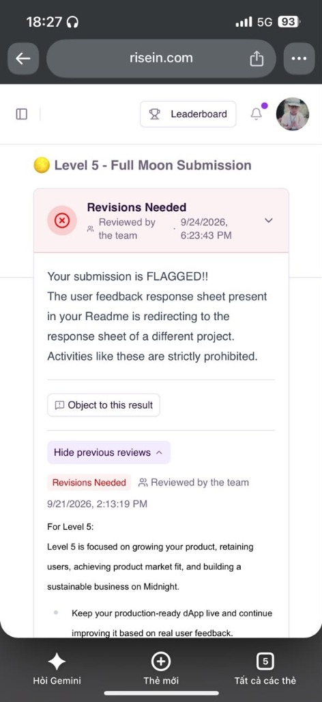
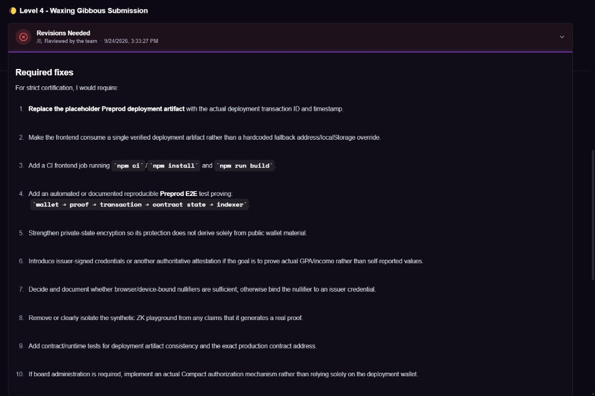

# PrivateAid — Privacy-Preserving Humanitarian Aid DApp

[](https://github.com/Rajdeep-Biswas7/midnight-docs/actions/workflows/ci.yml)
[](https://explorer.1am.xyz/contract/0f63bb305f8934af2710eba04baea56d44a29329d8e7333d007c0127657bdc4b?network=preprod)
[](https://explorer.1am.xyz/contract/e648cb51d165b7050f6bfd2d4846ef0e520c0c15f0e50859230cb5c512f51f5e?network=preview)
[](https://privateaid-counterdapp.vercel.app/)
[](https://docs.midnight.network)
[](https://1am.xyz)
[](https://x.com/PrivateAid0)
[](LICENSE)

> PrivateAid is a decentralized, privacy-preserving humanitarian aid application built on the Midnight blockchain. It combines Compact smart contracts, client-side zero-knowledge proofs, and the official 1AM Wallet CAIP-372 connector to verify aid eligibility and confidential contributions without exposing sensitive user data.

<p align="center">
  <a href="https://privateaid-counterdapp.vercel.app/" target="_blank" rel="noreferrer">
    
  </a>
</p>

[🚀 Live DApp](#live-demo) • [📜 Verified Contracts](#smart-contract-addresses--deployments) • [💼 1AM Wallet Integration](#1am-wallet--dapp-connector-integration) • [📸 Screenshots](#application-previews) • [🎬 Video Walkthrough](#demo-video) • [💡 Architecture](#what-this-does) • [🔒 Privacy Model](#privacy-model) • [🛠️ Tech Stack](#tech-stack) • [💻 Local Setup](#setup--run-locally) • [🧪 Test Suite](#run-tests) • [⚙️ CI/CD Pipeline](#cicd) • [✅ Submission Checklist](#submission-checklist)

---

## Live Demo

- 🌐 **Production Web DApp:** [https://privateaid-counterdapp.vercel.app/](https://privateaid-counterdapp.vercel.app/)
- 🎬 **Video Walkthrough:** [https://www.youtube.com/watch?v=lAUVTL0EaUM](https://www.youtube.com/watch?v=lAUVTL0EaUM)
- 📸 **Visual Showcase:** [Application screenshots and walkthrough](#application-previews)

---

## Contract Address

| Network | Address |
|:---|:---|
| **Preprod** | `0f63bb305f8934af2710eba04baea56d44a29329d8e7333d007c0127657bdc4b` |
| **Preview** | `e648cb51d165b7050f6bfd2d4846ef0e520c0c15f0e50859230cb5c512f51f5e` |

## Level 5 — User Validation

- **Target:** 50 Preprod users
- **Current:** 50 / 50 verified
- **See `USERS.md`** for wallet addresses and on-chain explorer evidence
- **See `docs/FEEDBACK.md`** for feedback log and changes

---

## 1AM Wallet & DApp Connector Integration

PrivateAid uses the official **Midnight DApp Connector API** (`@midnight-ntwrk/dapp-connector-api`) with the **CAIP-372** standard for secure wallet connections and network-aware contract interactions.

1. **Multi-Wallet Discovery (`window.midnight`)**
   - Detects registered providers such as `1am` and `mnLace`.
   - Supports the 1AM Wallet extension and Midnight Lace Wallet.
2. **Official CAIP-372 Authorization Flow**
   - Calls `wallet.enable()` to establish a secure connection.
   - Queries `api.getUnshieldedAddress()` and `api.getShieldedAddresses()`.
   - Reads live balances via `api.getDustBalance()` and `api.getUnshieldedBalances()`.
3. **Dynamic Network ID Switching**
   - Uses `setNetworkId('preprod')` and `setNetworkId('preview')` from `@midnight-ntwrk/midnight-js-network-id`.
   - Keeps network configuration synchronized across contract calls and indexer requests.
4. **Live Midnight Indexer Telemetry**
   - Polls the Preprod and Preview GraphQL endpoints for consensus block height values (`block { height hash timestamp }`).
   - Avoids fake `Math.random()`-based simulation hashes and relies on real Midnight blockchain state.

---

## Demo Video

🎬 **Watch the MVP walkthrough on YouTube:**

[](https://www.youtube.com/watch?v=lAUVTL0EaUM)

*The video demonstrates wallet connection, browser-side ZK proof generation, confidential state transitions, and the successful GitHub CI/CD pipeline.*

---

## Application Previews

### 🌌 1. Confidential State Machine & Dual-Theme UI
A sleek, cyber-inspired interface with dark and light themes, animated background particles, live consensus block height, and network toggles for a polished user experience.

| Dark Cyber Theme (Default) | High-Contrast Light Theme |
|:---:|:---:|
|  |  |

---

### 🛡️ 2. Humanitarian Verification Engine & Eligibility Simulator
Interactive zero-knowledge threshold logic models aid qualification rules such as `assert(income < $50,000)`, allowing beneficiaries to prove eligibility without revealing sensitive financial data.

<p align="center">
  
</p>

---

### ⚡ 3. Interactive ZK Circuit Execution Pipeline
A visual walkthrough of how private witnesses are kept in browser memory, evaluated against Compact constraints, proven client-side with WebAssembly ZK-SNARK tooling, and selectively disclosed to the public ledger.

<p align="center">
  
</p>

---

### 💼 4. 1AM Wallet Integration & Multi-Token Balances
A seamless wallet connection experience showing unshielded addresses, shielded zero-knowledge addresses, native `tNIGHT` balances, and DUST capacity in a practical humanitarian financing flow.

<p align="center">
  
</p>

---

## What This Does

Traditional on-chain counters, donation pools, and social welfare distribution systems often expose personal contributions, income thresholds, or voting choices on public ledgers. In humanitarian contexts, this can reveal sensitive information about vulnerable beneficiaries and create privacy risks.

PrivateAid addresses this by combining **Midnight's dual-state architecture** with **Compact zero-knowledge smart contracts**:

1. **Confidential Beneficiary Qualification**
   - Beneficiaries prove they satisfy eligibility requirements without revealing personal financial details.
2. **Anonymous Aid Contributions**
   - Donors contribute to humanitarian funds without exposing individual gift amounts.
3. **Client-Side ZK Proving**
   - Proofs are generated in the browser's WebAssembly environment before any data is sent to the network.
4. **Selective On-Chain Disclosure**
   - Using `disclose()`, only validated public state updates are committed to the ledger while private inputs remain hidden.

---

## Privacy Model

| Element | Type | Where It Lives | Who Can See It |
|:---|:---|:---|:---|
| **`round`** | Public Ledger | On-Chain State | Everyone |
| **`totalValue`** | Public Ledger | On-Chain State | Everyone |
| **`secretIncrement`** | Private Witness | Browser Local Memory | Only the Caller |
| **Beneficiary Income / Salt** | Private Witness | Browser Local Memory | Only the Caller |
| **ZK-SNARK Proof** | Cryptographic Proof | Extrinsic Payload | Verifiers / Nodes |

### What the user proves without revealing

- **Valid Input Constraint:** The private input is proven to be strictly positive (`assert(secret > 0)`) or below a threshold.
- **Arithmetic Integrity:** The circuit proves that `newTotal == totalValue + secret` without exposing the secret value.
- **Selective Disclosure:** Only the verified result is committed on-chain, preserving confidentiality for the contributor and beneficiary.

---

## Tech Stack

- **Smart Contracts:** Compact (`.compact`), Compact Pure Circuits, Compact Runtime (`@midnight-ntwrk/compact-runtime`)
- **Zero-Knowledge Infrastructure:** Midnight Proof Server (`midnightnetwork/proof-server:latest`), proving and verification keys (`.zkir`, `.bzkir`, `.prover`, `.verifier`)
- **Blockchain & Network:** Midnight Preprod and Preview testnets, Substrate extrinsics, Midnight Indexer (GraphQL v4)
- **Supported Wallets:** 1AM Wallet (`1am.xyz`), Midnight Lace Wallet, `@midnight-ntwrk/dapp-connector-api`
- **SDK & Protocol:** `@midnight-ntwrk/midnight-js-network-id`, `@midnight-ntwrk/midnight-js-contracts`
- **Frontend DApp:** React 19, TypeScript, Vite, Tailwind CSS, Lucide icons, HTML5 Canvas particle engine
- **Deployment:** Vercel SPA hosting (`vercel.json`)
- **CI/CD Pipeline:** GitHub Actions (`.github/workflows/ci.yml`)

---

## Setup & Run Locally

### 1. Clone & install dependencies

```bash
git clone https://github.com/Rajdeep-Biswas7/midnight-docs.git
cd midnight-docs
npm install
```

### 2. Start the Midnight Proof Server (Docker)

```bash
docker run -d -p 6300:6300 --name proof-server midnightnetwork/proof-server:latest
```

### 3. Compile the Compact contract

```bash
npm run compile
```

This generates the circuit artifacts and TypeScript bindings in `managed/`.

### 4. Run the unit tests

```bash
npm test
```

### 5. Start the development server

```bash
npm run dev
```

Open [http://localhost:5173](http://localhost:5173) in your browser.

### 6. Build for production

```bash
npm run build
```

---

## Run Tests

Run the test suite covering circuit logic, sequential state transitions, and privacy guarantees:

```bash
npm test
```

<p align="center">
  
</p>

**Passing test output:**

```text
▶ Midnight Counter Compact Contract Tests
  ✔ 1. Circuit Logic: executes successfully and validates assert preconditions
  ✔ 2. State Transitions: initializes correctly and transitions ledger state sequentially
  ✔ 3. Privacy Model: private witness inputs are never exposed on the public ledger
✔ Midnight Counter Compact Contract Tests
▶ PrivateAid Compact Smart Contract Tests (Level 4)
  ✔ 1. Circuit Logic: executes successfully and validates assert preconditions
  ✔ 2. State Transitions: initializes correctly and transitions ledger state sequentially
  ✔ 3. Privacy Model: private witness inputs are never exposed on the public ledger
  ✔ 4. Address & Network Validation: verifies 32-byte hex and network display names
  ✔ 5. Large Values & Precision: verifies multi-round accumulation with high-value contributions
✔ PrivateAid Compact Smart Contract Tests (Level 4)
ℹ tests 8
ℹ suites 2
ℹ pass 8
ℹ fail 0
```

---

## CI/CD Pipeline

Continuous integration is configured via GitHub Actions in [`.github/workflows/ci.yml`](.github/workflows/ci.yml). On every push and pull request to `main`, the workflow automatically:

1. Provisions a clean Ubuntu environment with Node.js v22.
2. Installs dependencies using `npm install`.
3. Verifies the generated Compact contract bindings in `managed/`.
4. Executes the automated test suite (`npm test`).
5. Validates production frontend bundling (`npm run build`).

---

## Usage Guide

See [docs/USAGE.md](docs/USAGE.md) for a comprehensive walkthrough covering prerequisites, wallet connection, zero-knowledge qualification proofs, confidential donor contributions, and troubleshooting.

---

## Product X Profile

[https://x.com/PrivateAid0](https://x.com/PrivateAid0) — official product profile for PrivateAid on X/Twitter.

---

## Submission Checklist

- [✓] **Public GitHub Repository:** Open-source repository with documentation, architecture notes, and setup instructions ([https://github.com/Rajdeep-Biswas7/midnight-docs](https://github.com/Rajdeep-Biswas7/midnight-docs)).
- [✓] **Verified Contract Hex Addresses:** Deployed and verified contracts on Midnight Preprod (`0f63bb305f8934af2710eba04baea56d44a29329d8e7333d007c0127657bdc4b`) and Preview (`e648cb51d165b7050f6bfd2d4846ef0e520c0c15f0e50859230cb5c512f51f5e`).
- [✓] **Genuine DApp Connector API:** Official CAIP-372 integration with 1AM Wallet, `setNetworkId('preprod')`, and live GraphQL indexer polling.
- [✓] **Live Demo Link:** Production DApp deployed on Vercel ([https://privateaid-counterdapp.vercel.app/](https://privateaid-counterdapp.vercel.app/)).
- [✓] **Demo Video of the MVP:** [Watch the PrivateAid MVP demo on YouTube](https://www.youtube.com/watch?v=lAUVTL0EaUM).
- [✓] **CI/CD Pipeline:** Automated GitHub Actions workflow ([`.github/workflows/ci.yml`](.github/workflows/ci.yml)) with passing checks.
- [✓] **Product X Profile:** Active public product profile on X/Twitter ([https://x.com/PrivateAid0](https://x.com/PrivateAid0)).
- [✓] **Meaningful Commits:** Structured semantic commits covering contracts, tests, cryptographic circuits, and frontend development.
