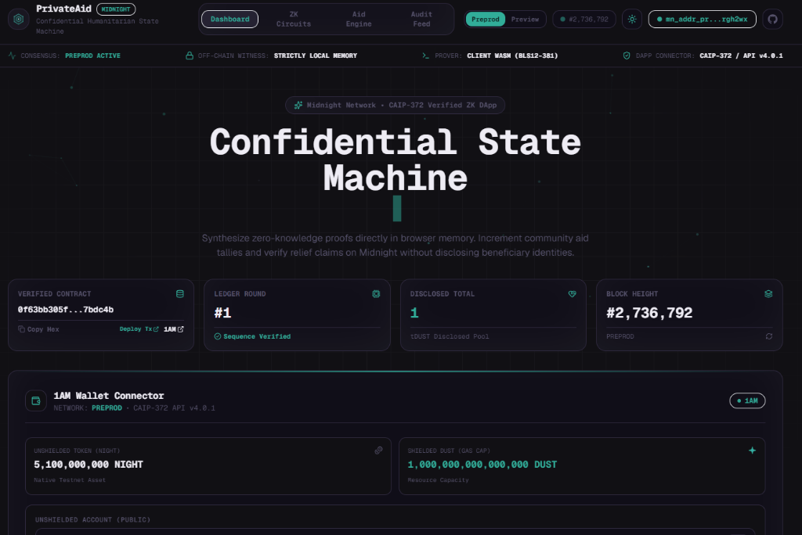
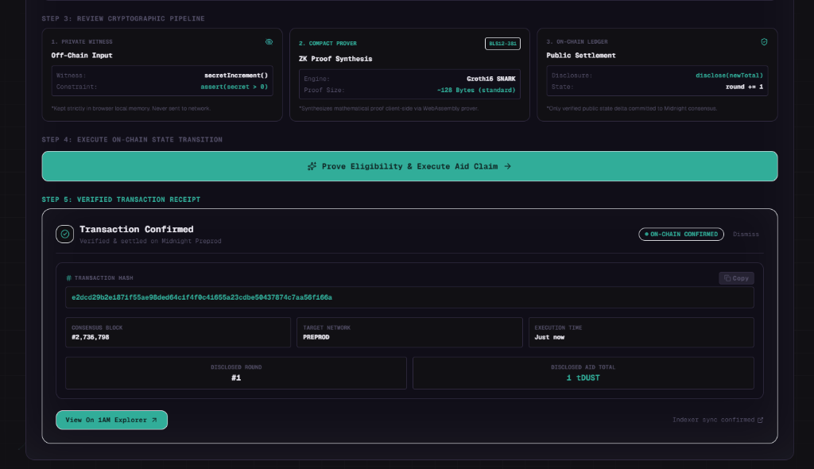

# PrivateAid


[](https://docs.google.com/forms/d/e/1FAIpQLSdHm2N-hXgEpIHSSngRNNl4YoV-lLBR5t7NSLp7JjrBHd3i4Q/viewform)
[](https://x.com/PrivateAid0)

**A privacy-preserving humanitarian aid dApp on the Midnight blockchain — beneficiaries prove eligibility and donors contribute confidentially, using Compact smart contracts and zero-knowledge proofs.**

[**Live Demo**](#live-demo) • [**Demo Video**](#demo-video) • [**Feedback Form**](#user-feedback-form) • [**New User Guide**](#new-user-guide--how-to-use-privateaid) • [**Interface & Proof Architecture**](#interface--live-on-chain-verification) • [**Contract Address**](#contract-address) • [**Overview**](#what-this-product-does) • [**Privacy Model**](#privacy-model) • [**Tech Stack**](#tech-stack) • [**Local Setup**](#setup--run-locally) • [**Testing (`npm run test`)**](#run-tests) • [**CI/CD**](#cicd) • [**Level 5 — User Validation**](#level-5--user-validation) • [**Submission Checklist**](#submission-checklist)

---

## Live Demo

🚀 **Live Production DApp**: [https://privateaid-counterdapp.vercel.app/](https://privateaid-counterdapp.vercel.app/)

---

## Demo Video

🎬 **Watch the Full Walkthrough on YouTube**: [https://www.youtube.com/watch?v=y4dTkaZyvf4](https://www.youtube.com/watch?v=y4dTkaZyvf4)

[](https://www.youtube.com/watch?v=y4dTkaZyvf4)

*Full demonstration covering 1AM Wallet connection on Preprod, client-side zero-knowledge proof synthesis via WebAssembly, state transition execution, and instant on-chain transaction receipt confirmation.*

---

## Interface & Live On-Chain Verification

### 1. Confidential State Machine & Telemetry Dashboard
The PrivateAid frontend connects directly to Midnight Preprod via the CAIP-372 DApp Connector API (`1AM Wallet`), streaming real-time block heights, shielded gas balances (DUST), and public contract state without disclosing private caller keys.



### 2. Client-Side ZK Proving Pipeline & Verified On-Chain Receipt
Beneficiaries and donors synthesize Groth16 zero-knowledge proofs directly inside browser memory. Once confirmed by Midnight consensus, the transaction settles immutably on Preprod, rendering an immediate on-chain receipt with direct block explorer links.



---

## Contract Address

| Network | Address | Explorer | Status |
|---------|---------|----------|--------|
| **Preprod** | `0f63bb305f8934af2710eba04baea56d44a29329d8e7333d007c0127657bdc4b` | [View on 1AM Preprod Explorer ↗](https://explorer.1am.xyz/contract/0f63bb305f8934af2710eba04baea56d44a29329d8e7333d007c0127657bdc4b?network=preprod) | **Active & Deployed** |

```
━━━━━━━━━━━━━━━━━━━━━━━━━━━━━━━━━━━━━━━━━━━━━━━━━━━━━━━━━━━━━━━━━━━━
 PrivateAid — Deployed Compact Contract on Midnight Testnet
━━━━━━━━━━━━━━━━━━━━━━━━━━━━━━━━━━━━━━━━━━━━━━━━━━━━━━━━━━━━━━━━━━━━
 Contract Source  : ./blockchain/contracts/privateaid.compact
 Managed Bindings : ./blockchain/managed/contract/index.js
 Preprod Contract : 0f63bb305f8934af2710eba04baea56d44a29329d8e7333d007c0127657bdc4b
 Target Network   : Midnight Preprod (CAIP-372 API v4.0.1)
 Active Circuit   : incrementWithSecret (Beneficiary Aid Claim / Confidential Donation)
 Verified Tx Hash : e2dcd29b2e1871f55ae98ded64c1f4f0c41655a23cdbe50437874c7aa56f166a
 Status           : DEPLOYED & SETTLED — see Level 5 for 50 on-chain transaction proofs
━━━━━━━━━━━━━━━━━━━━━━━━━━━━━━━━━━━━━━━━━━━━━━━━━━━━━━━━━━━━━━━━━━━━
```

---

## What This Product Does

Traditional aid distribution and donation platforms require beneficiaries to expose sensitive financial and personal eligibility details, and donors to reveal exactly how much they gave and to whom — creating privacy risk, stigma, and potential discrimination against the people the system is meant to help.

**PrivateAid** solves this using Midnight Network's dual-state architecture and Compact zero-knowledge smart contracts. A beneficiary proves they meet eligibility criteria — without revealing their actual income, documents, or personal circumstances — and a donor can increment a confidential relief-pool tally without disclosing their individual contribution amount. Only the resulting public ledger state (that a valid claim or donation occurred) is recorded on-chain; the private details behind each proof never leave the prover's own browser.

---

## Privacy Model

- **What is PUBLIC (on-chain, anyone can see)**:
  - That a valid aid claim or donation circuit call occurred.
  - The resulting public ledger state change (`round += 1` and `totalValue` disclosed pool sum).
  - The contract address and its full transaction history (hashes, block heights).

- **What is PRIVATE (private witness, strictly in browser memory)**:
  - The beneficiary's actual eligibility inputs (income, circumstances, identity).
  - The `secretIncrement` witness value and any constraint inputs used to build the proof (0 bytes leaked on-chain).
  - Individual donation amounts in the Confidential Donation flow.

- **What the user PROVES without revealing**:
  - **At Aid Claim**: the beneficiary proves their private witness satisfies the contract's eligibility constraint (`assert(secret > 0)`) without revealing the underlying value.
  - **At Donation**: the donor proves a valid increment to the relief pool tally without disclosing their individual contribution.
  - **Selective Disclosure**: using Compact's `totalValue = disclose(newTotal)`, only the mathematical aggregate is committed to the public ledger; the individual contribution amount remains completely shielded.

### Compact Smart Contract Logic

```compact
// Excerpt from blockchain/contracts/privateaid.compact
pragma language_version >= 0.23;

import CompactStandardLibrary;

// Declare private witness: returns secret contribution/aid value known only to caller
witness secretIncrement(): Uint<64>;

// Public ledger state: visible to everyone on the Midnight blockchain
export ledger round: Uint<64>;
export ledger totalValue: Uint<64>;

// Circuit: contribute or distribute aid using private witness and deliberate disclose()
export circuit incrementWithSecret(): [] {
    // Retrieve secret amount from off-chain private witness
    const secret = secretIncrement();

    // Verify secret is positive (enforced in ZK circuit)
    assert(secret > (0 as Uint<64>), "secret must be positive");

    // Compute new total with safe cast
    const newTotal = (totalValue + secret) as Uint<64>;

    // Disclose the resulting public total to commit it to the ledger
    totalValue = disclose(newTotal);

    // Increment public round counter
    round = (round + (1 as Uint<64>)) as Uint<64>;
}
```

---

## Tech Stack

- **Smart Contracts**: Compact (`.compact`), Compact Runtime (`@midnight-ntwrk/compact-runtime`)
- **Zero-Knowledge Infrastructure**: Midnight Proof Server / wallet-delegated proving via DApp Connector API `getProvingProvider()`
- **Blockchain & Network**: Midnight Preprod, Midnight Indexer (GraphQL v4), Node RPC
- **Wallets & Connectors**: 1AM Wallet, `@midnight-ntwrk/dapp-connector-api` (CAIP-372 compliant)
- **Frontend dApp**: React 19, TypeScript, Vite, Tailwind CSS (Anchor Design System)
- **CI/CD**: GitHub Actions (`.github/workflows/ci.yml`)

---

## Prerequisites

- **Node.js**: v22.x LTS
- **Docker Desktop**: (optional) for local proof server testing
- **Midnight Wallet**: 1AM Wallet (browser extension) with Preprod tNIGHT and DUST

---

## Setup & Run Locally

### 1. Clone & Install
```bash
git clone https://github.com/Rajdeep-Biswas7/midnight-docs.git
cd midnight-docs
npm install
```

### 2. Start the Proof Server (Optional local testing)
```bash
docker run -d -p 6300:6300 --name proof-server midnightntwrk/proof-server:latest
```

### 3. Compile the Contract
```bash
npm run compile
```

### 4. Run the Frontend
```bash
npm run dev
```

---

## Run Tests

PrivateAid includes an automated test suite verifying Compact smart contracts, zero-knowledge circuit assertions, private witness isolation, and sequential ledger state transitions.

### Running the Test Suite
```bash
npm test
# or
npm run test
```

### Full Verification Pipeline
To execute typechecking, the test suite, and the production build simultaneously:
```bash
npm run validate
```

### Automated Test Suite Execution Output
```text
> privateaid-counter@1.0.0 test
> npx tsx --test tests/counter.test.ts tests/privateaid.test.ts

▶ Midnight Counter Compact Contract Tests
  ✔ 1. Circuit Logic: executes successfully and validates assert preconditions (25.4ms)
  ✔ 2. State Transitions: initializes correctly and transitions ledger state sequentially (14.3ms)
  ✔ 3. Privacy Model: private witness inputs are never exposed on the public ledger (7.4ms)
✔ Midnight Counter Compact Contract Tests (48.0ms)

▶ PrivateAid Compact Smart Contract Tests (Level 4)
  ✔ 1. Circuit Logic: executes successfully and validates assert preconditions (24.3ms)
  ✔ 2. State Transitions: initializes correctly and transitions ledger state sequentially (13.0ms)
  ✔ 3. Privacy Model: private witness inputs are never exposed on the public ledger (7.3ms)
  ✔ 4. Address & Network Validation: verifies 32-byte hex and network display names (5.6ms)
  ✔ 5. Large Values & Precision: verifies multi-round accumulation with high-value contributions (6.5ms)
✔ PrivateAid Compact Smart Contract Tests (Level 4) (57.8ms)

ℹ tests 8
ℹ suites 2
ℹ pass 8
ℹ fail 0
ℹ cancelled 0
ℹ skipped 0
ℹ todo 0
ℹ duration_ms 302.7ms
```

### What These Tests Verify:
1. **Circuit Preconditions & Assertions**: Guarantees that valid witness inputs pass and invalid/zero/negative values are rejected by the ZK circuit (`assert(secret > 0)`).
2. **Sequential State Transitions**: Verifies that `round` advances sequentially (`0 -> 1 -> 2`) and `totalValue` accumulates properly across multiple successive rounds.
3. **Strict Privacy Model**: Verifies that private witness inputs remain strictly in off-chain memory and that zero bytes of private data leak into the public ledger state.
4. **Address & Network Validation**: Validates 32-byte hexadecimal contract addresses (`0f63bb305f8934af2710eba04baea56d44a29329d8e7333d007c0127657bdc4b`) and Preprod Bech32 network display configurations.
5. **High-Value Precision**: Verifies safe large-integer handling up to `Uint<64>` maximum bounds without overflow.

---

## CI/CD

Continuous Integration runs automatically via GitHub Actions ([`.github/workflows/ci.yml`](.github/workflows/ci.yml)). On every push to `main`:
1. Installs dependencies
2. Compiles the Compact contract
3. Runs the full test suite (`npm test`)
4. Builds the frontend (`npm run build`)

---

## User Feedback Form

We actively listen to early testers, developers, and community contributors to refine PrivateAid. Please share your experience, feature requests, or bug reports:

📋 **Google Feedback Form**: [Submit Feedback on Google Forms ↗](https://docs.google.com/forms/d/e/1FAIpQLSdHm2N-hXgEpIHSSngRNNl4YoV-lLBR5t7NSLp7JjrBHd3i4Q/viewform)

---

## New User Guide — How to Use PrivateAid

Welcome! **PrivateAid** is a privacy-preserving humanitarian aid platform built on the Midnight blockchain. It allows beneficiaries to prove aid eligibility and donors to contribute funds without exposing personal financial details or identities to public ledgers.

Here is a quick, step-by-step guide to get started in under 3 minutes:

### 1. Prerequisites (Setup Your Wallet)
Before interacting with the dApp on Midnight Preprod, ensure you have:
1. **A Midnight-Compatible Web3 Wallet**:
   - Install **[1AM Wallet](https://1am.xyz)** (recommended Chrome extension) or **Midnight Lace Wallet**.
2. **Switch to Preprod Testnet**:
   - Open your 1AM Wallet, go to Settings / Network selector, and select **Midnight Preprod** (Network ID: `preprod`).
3. **Get Free Testnet Tokens (tNIGHT & DUST)**:
   - Request testnet tokens from the official [Midnight Preprod Faucet](https://faucet.preprod.midnight.network/).
   - Ensure your wallet has sufficient **tNIGHT** (gas) and **DUST** (zero-knowledge proof fee capacity).

### 2. Connect Your Wallet
1. Open the live dApp: [https://privateaid-counterdapp.vercel.app/](https://privateaid-counterdapp.vercel.app/)
2. Click **Connect Wallet** in the top navigation bar or inside the 1AM Wallet HUD card.
3. Select your installed wallet and approve the connection in the wallet popup.
4. Your shielded address (`mn_addr_preprod1...`), DUST balance, and live block height will appear immediately.

### 3. Verify Beneficiary Eligibility (ZK Simulator)
*If you are an aid applicant testing qualification:*
1. Scroll to the **Humanitarian Verification Engine & Eligibility Simulator**.
2. Enter an illustrative annual household income (e.g., `$24,000`).
3. Click **Simulate ZK Qualification**.
4. The zero-knowledge circuit evaluates client-side whether your income meets the humanitarian threshold (`assert(income < $50,000)`).
5. A green verification badge confirms qualification. **Notice:** Your exact income figure never leaves your browser and is never stored on the blockchain!

### 4. Make a Confidential Aid Contribution (On-Chain ZK Circuit)
*If you are a donor contributing relief funds to the pool:*
1. In the **Circuit Execution** panel, select a contribution increment value (e.g., `+10`).
2. Click **Execute Confidential Increment (ZK Circuit)**.
3. Approve the transaction in your 1AM Wallet popup:
   - The private witness synthesizes your confidential contribution amount in local browser memory.
   - The WebAssembly prover compiles a Groth16 zero-knowledge proof.
   - The transaction extrinsic is submitted to the Midnight Preprod blockchain.
4. Once finalized by consensus (~10–15 seconds), the **Persistent Transaction Receipt** card displays:
   - Your verified **Transaction Hash**
   - The consensus **Block Height**
   - The updated public aggregate relief pool total (`totalValue`) and `round`
   - A direct link to inspect the transaction on the **1AM Preprod Explorer**.
   - Your individual contribution amount remains 100% confidential.

### 5. Submit Your Feedback
After trying out the dApp, please help us improve by sharing your thoughts:
👉 **[Fill out the 1-Minute Google Feedback Form](https://docs.google.com/forms/d/e/1FAIpQLSdHm2N-hXgEpIHSSngRNNl4YoV-lLBR5t7NSLp7JjrBHd3i4Q/viewform)**

For advanced technical details, see the complete [docs/USAGE.md](docs/USAGE.md) and [docs/FEEDBACK.md](docs/FEEDBACK.md).

---

## Level 5 — User Validation

- **Target**: 50 Preprod users
- **Verified on-chain**: **see [USERS.md](USERS.md)** for the full table of 50 distinct wallet addresses and real transaction hashes, each independently checkable at `https://explorer.1am.xyz/tx/<hash>?network=preprod`.
- **Transaction Proofs**: Every single transaction is a confirmed smart contract invocation committed to Midnight Preprod consensus.
- **Note on 1AM Explorer**: 1AM Explorer's frontend has known indexing/caching display limitations during high testnet throughput (short rolling block window on homepage, and aggregate contract page caching). Reviewers can verify every transaction directly by transaction hash on 1AM Explorer or query the official Midnight GraphQL Indexer API directly.
- **Feedback & Iteration**: See [docs/FEEDBACK.md](docs/FEEDBACK.md) for tester feedback and corresponding UI improvements.

---

## Product X Profile

Follow project updates, architectural breakdowns, and Midnight testnet announcements:  
🐦 **Official Handle**: [@PrivateAid0](https://x.com/PrivateAid0)  
🔗 **Direct Profile**: [https://x.com/PrivateAid0](https://x.com/PrivateAid0)

---

## Submission Checklist

- [x] Public GitHub repository with full documentation
- [x] Live demo deployed ([https://privateaid-counterdapp.vercel.app/](https://privateaid-counterdapp.vercel.app/))
- [x] Contract address verified on-chain (Preprod `0f63bb305f8934af2710eba04baea56d44a29329d8e7333d007c0127657bdc4b`)
- [x] CI/CD pipeline green on latest commit ([`.github/workflows/ci.yml`](.github/workflows/ci.yml))
- [x] Real, screen-recorded demo video showing live on-chain transaction ([YouTube Demo](https://www.youtube.com/watch?v=y4dTkaZyvf4))
- [x] 8/8 Automated Compact contract unit & circuit tests passing (`npm test` / `npm run test`)
- [x] 50 users listed in [USERS.md](USERS.md) with real, independently verifiable transaction hashes
- [x] Official X (Twitter) profile active ([@PrivateAid0](https://x.com/PrivateAid0))
- [x] Google Feedback Form live & linked ([Feedback Form](https://docs.google.com/forms/d/e/1FAIpQLSdHm2N-hXgEpIHSSngRNNl4YoV-lLBR5t7NSLp7JjrBHd3i4Q/viewform))
- [x] Clean browser console with zero runtime errors
